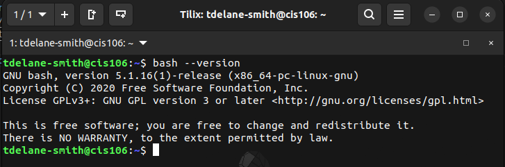
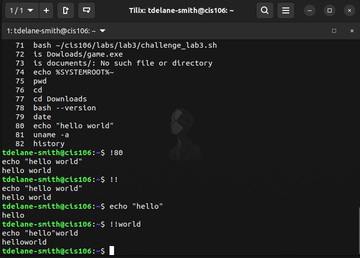
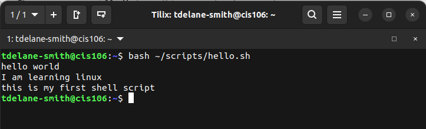
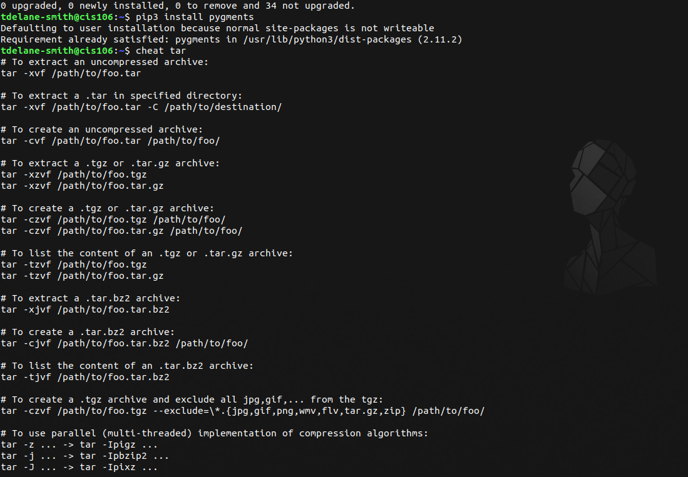
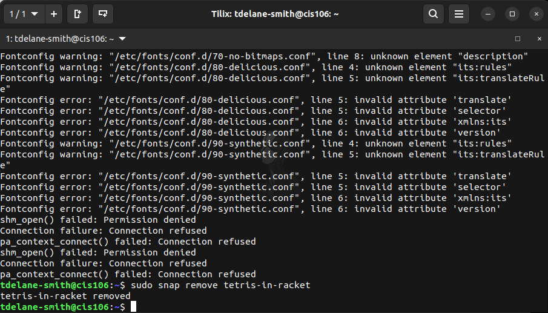

# Week Report 3 
## Completed work for week 3 
* [Lab 3](../../labs/lab3/lab3.md)
 * [Notes 1](../../notes/notes1/notes1.md)

### Practice 2: Accessing the bash shell 

### Practice 3: Using the command history 

### Practice 4: My first shell script 

### Practice 5: Using man
skipped

### Practice 6: Using help 
 

### Practice 7: Using cheat 

### Practice 1: Managing software 

### Practice 3: Installing and removing snaps 

### Practice 4: Working wit flatpak

### Practice 5: Using Applmage Pool 
skip